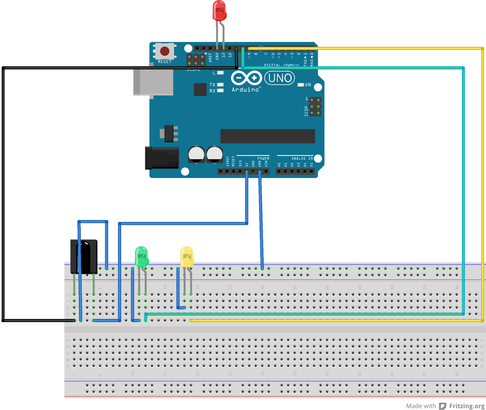
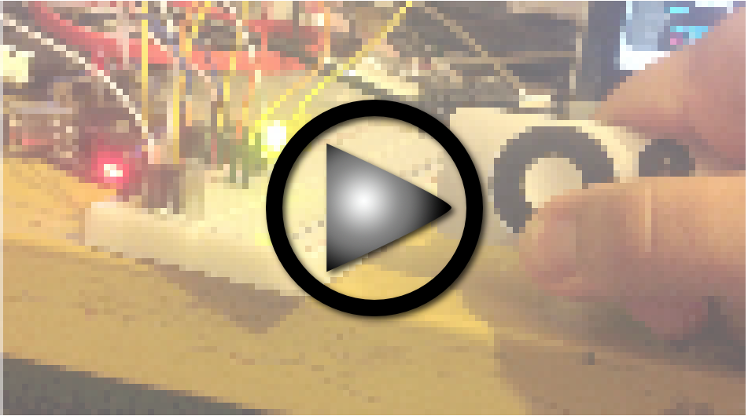

# Two diods
Arduino experiment with diodes and Apple Remote. Based on YouTube tutorial -- [Tutorial 1 Session 1: Arduino IR remote sensor and seven (7) segment display](http://www.youtube.com/watch?v=caMW1RRPOGE). As linked in this inspirational video, this solution requires IRRemote library form [linked docs](https://docs.google.com/folderview?usp=sharing&id=0B1Hqp8fKfwy4MTlNZzFJdzdoTTA).

## Schema

## Demo

